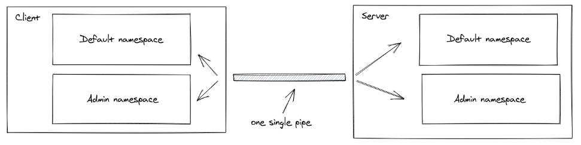

# Class 13

## Here is my Class 13 reading notes

[Socket.io Chat Example](https://socket.io/get-started/chat/)

1. Integrating Socket.IO

Socket.IO is composed of two parts:

* A server that integrates with (or mounts on) the Node.JS HTTP Server socket.io
* A client library that loads on the browser side socket.io-client

During development, socket.io serves the client automatically for us, as we’ll see, so for now we only have to install one module:

npm install socket.io

2. Emitting events

The main idea behind Socket.IO is that you can send and receive any events you want, with any data you want. Any objects that can be encoded as JSON will do, and binary data is supported too.

Let’s make it so that when the user types in a message, the server gets it as a chat message event.

3. Emitting events

The main idea behind Socket.IO is that you can send and receive any events you want, with any data you want. Any objects that can be encoded as JSON will do, and binary data is supported too.

Let’s make it so that when the user types in a message, the server gets it as a chat message event. The script section in index.html should now look as follows:

[Rooms](https://socket.io/docs/v4/rooms)

1. A room is an arbitrary channel that sockets can join and leave. It can be used to broadcast events to a subset of clients:

"Quoting from the reading material"

2. Joining and leaving
You can call join to subscribe the socket to a given channel:

"Quoting from the reading material"

[Namespaces](https://socket.io/docs/v4/namespaces/)

1. A Namespace is a communication channel that allows you to split the logic of your application over a single shared connection (also called "multiplexing").

"Quoting from the reading material"

2. Each namespace has its own:

* [Event handlers](https://socket.io/docs/v4/listening-to-events/)

* [Rooms](https://socket.io/docs/v4/rooms/)

* [Middlewares](https://socket.io/docs/v4/middlewares/)

"Quoting from the reading material"

3. Possible use cases:

* you want to create a special namespace that only authorized users have access to, so the logic related to those users is separated from the rest of the application

* your application has multiple tenants so you want to dynamically create one namespace per tenant

"Quoting from the reading material"

    For live access to my page, please visit the following link:
<https://github.com/timothee2022/My-Reading-Notes-Code-Fellows.git>
