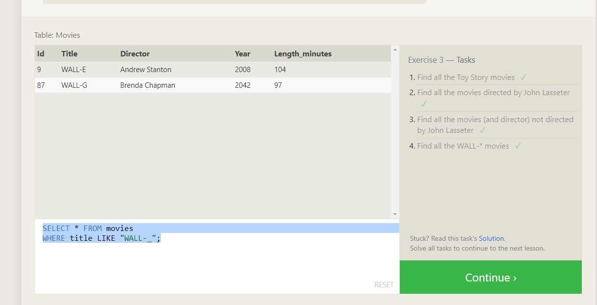

SQL Practice

SQL
SQL, which stands for Structured Query Language, is the programming language used to communicate with a relational database.
"Quoting from the reading material"

Structured Data
In order to better learn about structured data, it is useful to understand the problem that it aims to solve: the limitations of unstructured data. Unstructured data is data that contains information without any structure, such as content inside emails or books or images.
"Quoting from the reading material"

;
;
;
;
;

For live access to my page, please visit the following link:
<https://github.com/timothee2022/My-Reading-Notes-Code-Fellows.git>